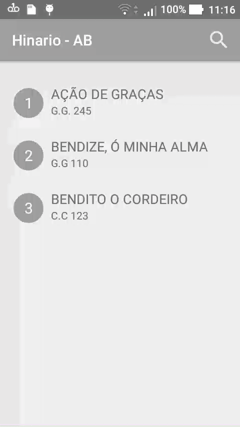

# Music viewer app

This repository contains the source code of an Android App to load music lyrics of an existing database in a RecyclerView.

The main purpose of this project was to learn how to use an existing database stored on the assets folder.

